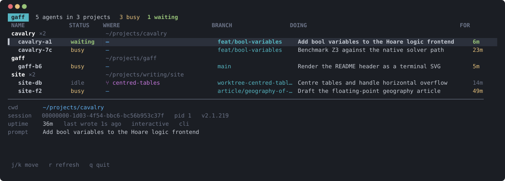

# gaff



gaff is a terminal user interface (TUI) listing every running Claude Code agent, grouped by the project it belongs to. Running several at once makes it easy to lose track of which one is working, which one is blocked, and where each one is; gaff reads the command-line interface (CLI)'s own on-disk state and renders it as a single table.

## Usage

```
gaff            # the TUI
gaff --once     # print the table and exit
```

Keys: `j`/`k` or arrows to move, `g`/`G` for first and last, `r` to force a refresh, `q` to quit. Project headings are skipped when moving.

## The columns

- `STATUS` — the CLI's own value: `busy`, `idle`, `ready`, `waiting`, `running` or `error`. Unrecognised values render in grey rather than being hidden, since the set belongs to Claude Code and may grow.
- `FOR` — how long the agent has held that status. For a `waiting` agent that is how long it has been blocked on you, which is why waiting agents sort first within their project.
- `WHERE` — position within the project: `⑂ name` for a *worktree*, a relative path for a subdirectory, `—` at the project root.
- `DOING` — a model-generated one-line summary of the work, read from the session transcript.

Projects sort alphabetically rather than by urgency, because a group that jumps position whenever one of its agents changes status is harder to find than one that stays put.

## Building

```
cargo build --release
cargo test
```

Continuous integration (CI) checks formatting, runs clippy with `-D warnings`, builds in debug and runs the tests. The same formatting and lint pair is available as a *pre-commit hook*, which each clone enables once — git does not clone hooks:

```
git config core.hooksPath .githooks
```

## Where the data comes from

Two locations, both internal to Claude Code and both undocumented: `~/.claude/sessions/<pid>.json`, one file per live process, and `~/.claude/projects/<slug>/<session-id>.jsonl`, the session transcript. Registry files are removed on graceful exit only, so gaff verifies each process identifier (PID) with `kill(pid, 0)` and drops entries whose process is gone. The transcript corpus reaches hundreds of megabytes, so transcripts are followed incrementally rather than re-read.

Every field beyond `pid` and `sessionId` is parsed as optional, so a schema change degrades the display rather than breaking the tool. That is the most that can be promised: this reads private state belonging to another program, and nothing obliges that program to keep its shape. The version each agent reports is shown in the detail pane, which is the first place to look when a column goes empty.
